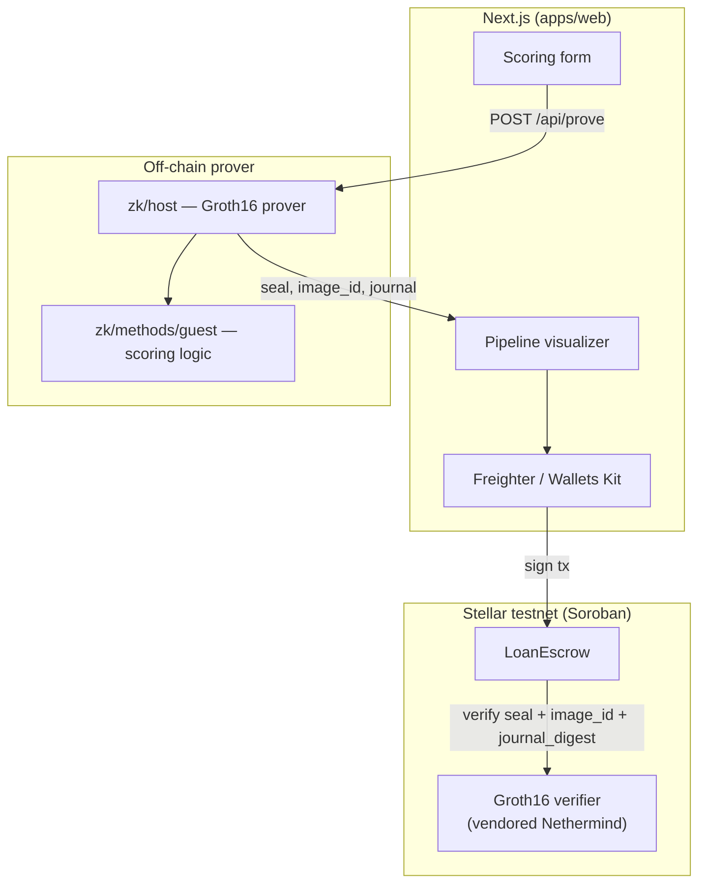

# VeriCompute

**Verifiable compute + conditional payment on Stellar.**

> **Stellar Hacks — Real-World ZK** · RISC Zero Groth16 proofs verified on Soroban · Escrow settles only after on-chain verification

If you pay someone to run a deterministic computation — credit scoring, eligibility checks, fraud rules, model inference — you currently have to **trust** they used your program on your input. VeriCompute closes that gap: a provider runs your guest program inside the **RISC Zero zkVM**, submits the Groth16 receipt to **Soroban**, and an **escrow contract** releases funds only when verification succeeds.

Credit scoring is the flagship demo. The scoring logic lives in a swappable module behind the same **prove → verify → settle** protocol.

---

## Table of contents

- [The problem](#the-problem)
- [The solution](#the-solution)
- [Architecture](#architecture)
- [End-to-end flow](#end-to-end-flow)
- [Why ZK is load-bearing](#why-zk-is-load-bearing)
- [Tech stack](#tech-stack)
- [Repository layout](#repository-layout)
- [Quick start](#quick-start)
- [Environment variables](#environment-variables)
- [What's real vs simplified](#whats-real-vs-simplified)
- [Generalization beyond credit scoring](#generalization-beyond-credit-scoring)
- [Remote prover options](#remote-prover-options)
- [Demo video script (~2 min)](#demo-video-script-2-min)
- [Hackathon alignment](#hackathon-alignment)
- [References](#references)

---

## The problem

Outsourced AI and deterministic compute today has a trust gap:

- A provider can swap in a cheaper model or ruleset
- They can run on different (or stale) inputs
- They can fabricate outputs entirely

Payment happens anyway. There is no cryptographic link between **what you paid for** and **what actually ran**.

## The solution

VeriCompute is a **general protocol** for verifiable compute with conditional settlement:

| Role | Responsibility |
|------|----------------|
| **Requester** | Specifies the task (guest program + input) |
| **Provider** | Runs the guest in RISC Zero, produces a Groth16 receipt |
| **Verifier (Soroban)** | Cryptographically checks the receipt against the expected program (`image_id`) |
| **Escrow (Soroban)** | Holds funds; pays the provider on valid proof; conditionally releases the loan to the borrower based on the verified score |

**No valid proof → no settlement.** The demo walks through synthetic applicant data → zkVM proof → on-chain verification → escrow payout on Stellar testnet.

---

## Architecture



**Journal layout (68 bytes, committed in zkVM):**

```
input_hash (32) || output_hash (32) || score u32 LE (4)
```

The escrow contract decodes `score` from the journal after the verifier accepts the Groth16 seal.

---

## End-to-end flow

1. User fills the **synthetic** credit-scoring form in the demo UI.
2. `/api/prove` invokes the RISC Zero host (local WSL subprocess or remote HTTP prover).
3. Host runs `scoring::compute_score` inside the guest ELF and returns `proof.json` fields: `seal`, `image_id`, `journal_digest`, `journal_hex`, `score`.
4. User connects **Freighter** (testnet) and signs `create_request` then `submit_proof_and_settle` on `LoanEscrow`.
5. Escrow cross-invokes the Groth16 verifier; on success it pays the provider fee and either disburses the loan (score ≥ threshold) or returns principal to the lender.
6. UI shows verification status, score, outcome, and a **Stellar Expert** transaction link.

---

## Why ZK is load-bearing

This is not a cosmetic ZK badge:

- The **guest program identity** (`image_id`) is checked on-chain — a substituted program fails verification.
- The **Groth16 seal** is verified by the Nethermind Soroban verifier, not a trusted server.
- **Settlement is conditional** on that verification; invalid proofs revert before any payout.
- The journal binds **input hash**, **output hash**, and the public **score** the escrow reads.

What is *not* claimed: we do not run a full LLM inside the zkVM (proving time makes that impractical for a live demo). The guest is a small deterministic rules engine — the README and UI label this honestly. The architecture generalizes to any deterministic guest you can compile to RISC Zero.

---

## Tech stack

| Layer | Technology |
|-------|------------|
| Frontend | Next.js (App Router), TypeScript, Tailwind CSS |
| Wallet | [Stellar Wallets Kit](https://stellarwalletskit.dev/) |
| Chain SDK | `@stellar/stellar-sdk` |
| ZK | [RISC Zero](https://dev.risczero.com/) zkVM 3.x, Groth16 receipts |
| Verifier | [Nethermind `stellar-risc0-verifier`](https://github.com/NethermindEth/stellar-risc0-verifier) (vendored) |
| Contracts | Soroban Rust (`LoanEscrow` + Groth16 verifier) |
| Network | **Stellar testnet only** — no mainnet, no real funds |

---

## Repository layout

| Path | Purpose |
|------|---------|
| `apps/web` | Demo UI — landing, `/demo`, `/how-it-works`, API routes |
| `zk/methods` + `zk/methods/guest` | RISC Zero guest crate + embedded ELF (`GUEST_ID`) |
| `zk/host` | Groth16 prover CLI and optional HTTP server (`POST /prove`) |
| `vendor/stellar-risc0-verifier` | Vendored Nethermind Groth16 verifier (via script) |
| `contracts/escrow` | `LoanEscrow` — fund lock, verify, conditional payout |
| `scripts/` | WSL setup, vendor, deploy, on-chain verify checkpoint |
| `deployments/testnet.json` | Written by deploy script (local; not committed with secrets) |

---

## Quick start

### Prerequisites

- **WSL2 (Ubuntu)** recommended on Windows for proving and contract deploy
- **Docker** (Groth16 proving on x86_64 Linux)
- **Node.js 18+**
- **Rust** (`rustup`)
- **RISC Zero** — `curl -L https://risczero.com/install | bash`, then `rzup install` and `rzup install risc0-groth16`
- **Stellar CLI** — `cargo install stellar-cli --locked`
- **Freighter** wallet configured for **testnet**

### 1. Toolchain (WSL)

```bash
./scripts/setup-wsl.sh
source ~/.cargo/env
export PATH=$HOME/.risc0/bin:$PATH
rzup install
rzup install risc0-groth16
```

If `apt-get` hangs in WSL, fix DNS (run as root):

```bash
printf 'nameserver 1.1.1.1\nnameserver 8.8.8.8\n' > /etc/resolv.conf
```

### 2. Prove locally (checkpoint)

```bash
cargo run --release -p vericompute-host \
  -- --input zk/host/examples/sample_input.json \
  --output proof.json
```

`proof.json` contains `seal`, `image_id`, `journal_digest`, `journal_hex`, and `score`. The bundled sample input scores **512** with the default rules.

### 3. Deploy contracts (testnet)

```bash
stellar keys generate vericompute --network testnet
stellar keys fund vericompute --network testnet
./scripts/vendor-verifier.sh
NETWORK=testnet IDENTITY=vericompute ./scripts/deploy-testnet.sh
```

This writes `deployments/testnet.json` with `verifier_contract_id` and `escrow_contract_id`.

### 4. Initialize escrow

Run after deploy and after you have `image_id` from `proof.json`. Use the testnet native XLM [Stellar Asset Contract](https://developers.stellar.org/docs/build/guides/basics/contract-interactions/stellar-asset-contract) (verify current address in Stellar docs if invoke fails):

```bash
VERIFIER_ID=$(jq -r .verifier_contract_id deployments/testnet.json)
ESCROW_ID=$(jq -r .escrow_contract_id deployments/testnet.json)
IMAGE_ID=$(jq -r .image_id proof.json)
ADMIN=$(stellar keys address vericompute)
# Testnet native XLM SAC — confirm on https://developers.stellar.org if this changes
TOKEN_ID=CDLZFC3SYJYDZT7K67VZ75HPJVIEUVNIXF47ZG2FB2RMQQAHHX2TSBWL

stellar contract invoke \
  --network testnet \
  --source-account vericompute \
  --id "$ESCROW_ID" \
  -- \
  init \
  --admin "$ADMIN" \
  --verifier "$VERIFIER_ID" \
  --image_id "$IMAGE_ID" \
  --token "$TOKEN_ID"
```

### 5. Verify proof on-chain (CLI checkpoint)

```bash
NETWORK=testnet IDENTITY=vericompute ./scripts/verify-proof-cli.sh
```

### 6. Frontend

```bash
cp .env.example apps/web/.env.local
```

Fill in from `deployments/testnet.json`:

```env
NEXT_PUBLIC_VERIFIER_CONTRACT_ID=<verifier_contract_id>
NEXT_PUBLIC_ESCROW_CONTRACT_ID=<escrow_contract_id>
```

```bash
cd apps/web
npm install
npm run dev
```

Open [http://localhost:3000/demo](http://localhost:3000/demo). If contract IDs are missing, the UI shows a **NOT CONFIGURED** banner instead of faking on-chain success.

---

## Environment variables

See [`.env.example`](.env.example).

| Variable | Purpose |
|----------|---------|
| `NEXT_PUBLIC_VERIFIER_CONTRACT_ID` | Deployed Groth16 verifier |
| `NEXT_PUBLIC_ESCROW_CONTRACT_ID` | Deployed `LoanEscrow` |
| `NEXT_PUBLIC_TOKEN_CONTRACT_ID` | SAC used by escrow (optional in UI) |
| `PROVER_SERVICE_URL` | Remote prover base URL (`POST /prove`) |
| `PROVER_WSL_REPO_PATH` | WSL path to repo when proving from Windows Next.js |
| `GUEST_IMAGE_ID` | Guest program identity from `proof.json` |

---

## What's real vs simplified

| Real (production-shaped) | Simplified / demo |
|--------------------------|-------------------|
| RISC Zero Groth16 proving in zkVM | Rules-based score, not an LLM or large ML model |
| `encode_seal()` + SHA-256 `journal_digest` for Soroban | Synthetic applicant form data |
| Soroban verifier + `LoanEscrow` on testnet | Same wallet often plays lender, borrower, and provider |
| Wallet-signed transactions via Stellar Wallets Kit | Local/WSL prover; optional GitHub Actions remote prover |
| Escrow pays provider on valid proof; conditional loan release | Testnet XLM only — no real money |

We label mocked or synthetic elements in the UI (e.g. **synthetic data** badge on the scoring form). Judges should never wonder what is real.

---

## Generalization beyond credit scoring

The guest program is intentionally modular:

- **Task logic** lives in `zk/methods/guest/src/scoring.rs` (`compute_score`).
- **zkVM I/O** (read input, hash, commit journal) lives in `main.rs`.
- Swapping credit scoring for another deterministic function (eligibility, fraud rules, content policy) means replacing the scoring module and redeploying with the new `image_id` — the host, verifier integration, and escrow flow stay the same.

Conceptually, any computation that is **deterministic** and **small enough to prove in reasonable time** fits this protocol — including distilled rules or compact models derived from larger AI systems.

---

## Remote prover options

Groth16 proving requires Linux x86_64 + Docker in practice. If the Next.js app runs on Windows without WSL proving:

**Option A — HTTP prover**

```bash
cargo run --release -p vericompute-host -- --serve 0.0.0.0:8080
```

Set `PROVER_SERVICE_URL=http://host:8080` in `apps/web/.env.local`.

**Option B — GitHub Actions**

Manual workflow [`.github/workflows/prove.yml`](.github/workflows/prove.yml) builds and proves in CI; download the `proof-json` artifact.

---

## Demo video script (~2 min)

1. **Problem (15s):** Outsourced inference is unverifiable — providers can cheat.
2. **Protocol (20s):** RISC Zero proves correct execution; Soroban verifies; escrow pays only on success.
3. **Live demo (60s):** Fill synthetic form → proving spinner → connect Freighter → sign settlement → show score and outcome.
4. **On-chain proof (20s):** Open Stellar Expert link; point at verifier + escrow invocation.
5. **Close (15s):** General protocol — credit scoring is one swappable guest program.

---

## Hackathon alignment

| Criterion | How VeriCompute addresses it |
|-----------|-------------------------------|
| **Real-World ZK on Stellar** | Groth16 receipts verified in Soroban; settlement on testnet |
| **ZK is load-bearing** | Payment outcome depends on on-chain verification, not server trust |
| **Honest scope** | Synthetic data and rules-based scoring clearly labeled; no fake “verified” badges |
| **General protocol** | Swappable guest module; credit demo is one instance |
| **Reproducible** | Scripts for prove, deploy, verify CLI, and documented env setup |

**Implementation status:** Application code and contracts are complete in-repo. Live testnet deploy and the demo video are operator steps — follow [Quick start](#quick-start) with a funded testnet identity.

---

## References

- [Nethermind `stellar-risc0-verifier`](https://github.com/NethermindEth/stellar-risc0-verifier)
- [RISC Zero + Stellar tutorial (James Bachini)](https://jamesbachini.com/stellar-risc-zero-games/)
- [ZK proofs on Stellar (official docs)](https://developers.stellar.org/docs/build/apps/zk)
- [RISC Zero documentation](https://dev.risczero.com/)
- [Stellar agent skills](https://skills.stellar.org/)

---

## Further reading

- [`PRD.md`](PRD.md) — product requirements and user flows
- [`ARCHITECTURE.md`](ARCHITECTURE.md) — component boundaries and data flow
- [`TASKS.md`](TASKS.md) — build phases and checklist
